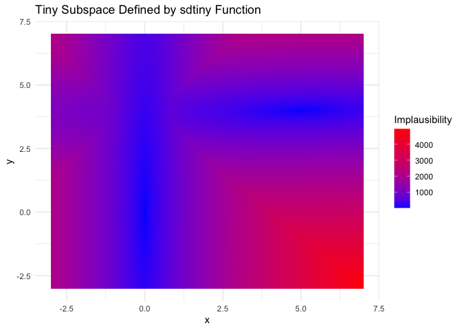
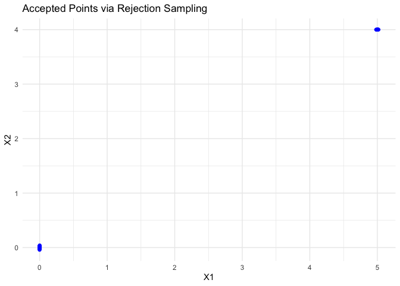
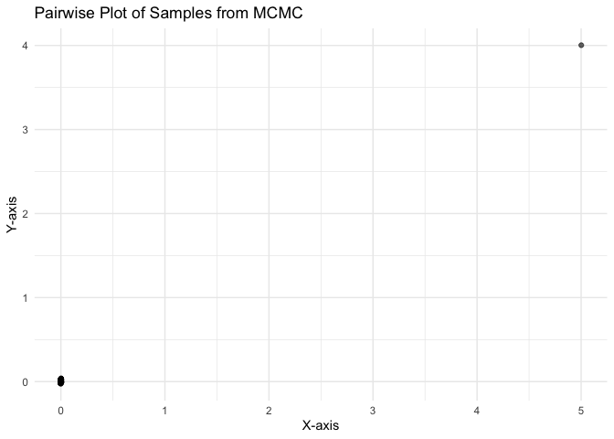
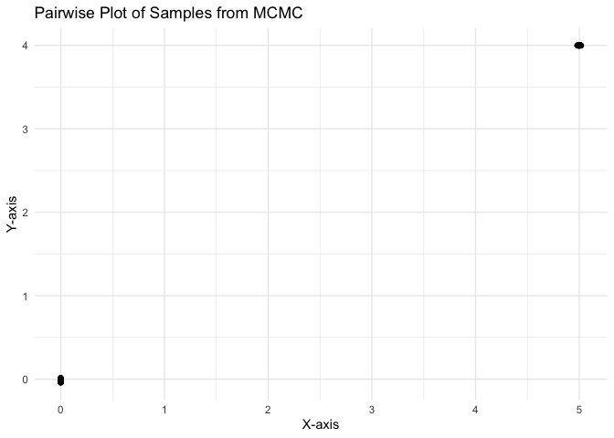

Tiny Subspace Example with Rejection Sampling
================
Daniel Williamson

# tinydancer

**tinydancer** is an R package designed to generate uniform samples from
tiny subspaces defined as level sets of an implausibility function. It
is especially useful for history matching and level set estimation in
Bayesian inference.

## Features

- Efficient sampling of tiny level sets.
- Parallel tempering and subset simulation support.
- Seamless integration with multi-wave history matching workflows.

## Installation

To install the package, clone this repository and use `devtools` in R:

``` r
devtools::install_github("BayesExeter/tinydancer")
```

``` r
library(tinydancer)
```

## Example: Defining a Tiny Space

Below is an example of defining a tiny subspace using a custom function,
`sdtiny`. This function calculates the scaled Mahalanobis distance from
two small Gaussian-like regions in a hypercube $[-3, 7]^2$.

### Defining the Function

``` r
# Define covariance matrices for two Gaussian-like regions
st1 <- rbind(c(0.000002, 0.000000875), c(0.000000875, 0.00025))
st2 <- rbind(c(0.00005, 0.000000825), c(0.000000825, 0.000002))

# Define the sdtiny function
sdtiny <- function(x, m1 = c(0, 0), m2 = c(5, 4), 
                    s1 = st1, s2 = st2) {
  coef1 <- (1 / ((s1[2, 2] * s1[1, 1]) - (s1[2, 1] * s1[1, 2])))
  s1inv <- coef1 * rbind(c(s1[2, 2], -s1[1, 2]), c(-s1[2, 1], s1[1, 1]))
  coef2 <- (1 / ((s2[2, 2] * s2[1, 1]) - (s2[2, 1] * s2[1, 2])))
  s2inv <- coef2 * rbind(c(s2[2, 2], -s2[1, 2]), c(-s2[2, 1], s2[1, 1]))
  sdevs1 <- sqrt(t(x - m1) %*% s1inv %*% (x - m1))
  sdevs2 <- sqrt(t(x - m2) %*% s2inv %*% (x - m2))
  return(min(sdevs1, sdevs2))
}
implausibility <- function(x, target_level=3) {
    sdtiny(x)
  }
```

### Plotting the Tiny Space

We can now visualize the tiny space defined by the `sdtiny` function by
plotting the distance in the hypercube $[-3, 7]^2$.

``` r
# Generate a grid of points in the hypercube
x_grid <- seq(-3, 7, length.out = 1000)
y_grid <- seq(-3, 7, length.out = 1000)
grid <- expand.grid(x = x_grid, y = y_grid)

# Calculate the distance for each point
distance_values <- apply(grid, 1, implausibility)

# Plot the distance
library(ggplot2)
ggplot(data = data.frame(grid, distance = distance_values), aes(x = x, y = y, fill = distance)) +
  geom_tile() +
  scale_fill_gradient(low = "blue", high = "red") +
  theme_minimal() +
  labs(title = "Tiny Subspace Defined by sdtiny Function", fill = "Implausibility")
```

<!-- -->

### Benchmarking with Rejection Sampling

In this example, we’ll use rejection sampling to sample points from the
space $[-3, 7]^2$. Throughout my many years history matching and working
with users I am regularly asked how to generate new points in the Not
Ruled Out Yet (NROY) space quickly. The issue these researchers have is
the same as that which inspired [my 2013 paper with Ian
Vernon](https://arxiv.org/abs/1309.3520) where some of the ideas in this
package were first presented. That is, the standard rejection sampling
approach, represented in code below, slows to an unworkable crawl.

``` r
library(lhs)
library(tictoc)

# Set up a rejection sampling loop
nKept <- 0
print("Rejection Sampling Started")
```

    ## [1] "Rejection Sampling Started"

``` r
tic()

kept <- c()
while(nKept < 100) {
  # Generate 20,000 Latin Hypercube Samples
  tLHS <- randomLHS(20000, 2)
  tLHS <- 10 * tLHS - 3  # Put on [-3, 7]^2 for comparison

  # Calculate implausibility for each point
  timps <- sapply(1:20000, function(i) implausibility(tLHS[i, ]))

  # Keep points with implausibility < 3
  kept <- rbind(kept, tLHS[timps < 3, ])
  nKept <- dim(kept)[1]
}
print("Timing for rejection sampling 100 points: ")
```

    ## [1] "Timing for rejection sampling 100 points: "

``` r
toc()
```

    ## 195.368 sec elapsed

This code takes 3-5 mins for 100 points on my macbook, despite the
implausibility having no overhead. History matching examples can often
involve evaluating many emulators per point, which, whilst fast, might
still take 0.01 or even 0.1 seconds per evaluation. For those unfamiliar
with UQ, it is standard to use random Latin Hypercubes to fill a
parameter space, but you will experience equivalent problems with
`runif`.

For reference, here is what the samples look like:

``` r
# Display the pairs plot of the accepted points using ggplot2
library(ggplot2)
kept_df <- data.frame(kept)
colnames(kept_df) <- c("X1", "X2")
ggplot(kept_df, aes(x = X1, y = X2)) +
  geom_point(color = 'blue', alpha = 0.5) +
  theme_minimal() +
  labs(title = "Accepted Points via Rejection Sampling", x = "X1", y = "X2")
```

<!-- -->

The 2013 contribution worked well, but the explanation was too
convoluted for one of our reviewers, and a lot of the details on
Evolutionary Monte Carlo got in the way of understanding. Despite this,
11 years later, the arXiv is still regularly cited and I am still often
asked for solutions to the tiny subspace problem. My co-author, Ian,
worked with a postdoc to produce `hmer`, a package for Bayes Linear
history matching which included our old method coded up in their `idemc`
function. They rightly claim it is “robust yet computationally intensive
\[…\] and should not be used by default.” I believe that their default
small space sampler, uses a slice sampler, but requires existing target
compatible samples (something often not available in my experience), and
offers no theoretical uniform convergence properties beyond those
afforded by slice sampling (we really need the region to be simply
connected). The methods there also require emulators rather than
implausibility, which means users that don’t use hmer for emulation but
still have this problem need to learn how to disguise their emulators as
emulators compatible with the package. Whilst hmer provides
functionality for this, the solution feels a little clunky compared with
passing a custom implausibility function and provides a barrier to users
that don’t use hmer for everything else. The implementation here also
allows for general level set sampling, without emulators or UQ.

`tinydancer` offers the robust sampling and theoretical guarantees of
our original idea, but with the speed and simplicity required to make it
useable as a default. It also offers new methods that are extremely fast
based on a custom subset simulation that offers uniform samples.

### Parallel Tempering with Slice sampling

In a single sentence, our 2013 idea was to exploit the nested structure
of level sets defined by implausibility to construct an efficient
temperature ladder for parallel tempering MCMC. Combined with slice
sampling for the individual chains and some efficient code, this method
can be both fast and robust.

First we find a temperature ladder to offer theoretically optimal mixing
(for parallel tempering), then we use the ladder to generate samples.
Here is the call wrapped in a timer for comparison with the rejection
sampler:

``` r
control_list <- list(
    box_limits = cbind(rep(-3, 2), rep(7, 2)),
    num_mutations = 20,
    num_iterations = 100
  )
  tic()
  new_ladder <- construct_temperature_ladder(
    implausibility = implausibility,
    dims = 2,
    target_levels = 3,
    control_list = control_list
  )
```

    ## Currently sampling a ladder with level sets: 362.40. Seeking the next ladder rung...

    ## Current number of chains = 2. Seeking the next implausibility level...

    ## Iteration 100 of 100 complete.

    ## Currently sampling a ladder with level sets: 362.40, 123.79. Seeking the next ladder rung...

    ## Current number of chains = 3. Seeking the next implausibility level...

    ## Iteration 100 of 100 complete.

    ## Currently sampling a ladder with level sets: 362.40, 123.79, 35.88. Seeking the next ladder rung...

    ## Current number of chains = 4. Seeking the next implausibility level...

    ## Iteration 100 of 100 complete.

    ## Currently sampling a ladder with level sets: 362.40, 123.79, 35.88, 13.17. Seeking the next ladder rung...

    ## Current number of chains = 5. Seeking the next implausibility level...

    ## Iteration 100 of 100 complete.

    ## Currently sampling a ladder with level sets: 362.40, 123.79, 35.88, 13.17, 4.31. Seeking the next ladder rung...

    ## Current number of chains = 6. Seeking the next implausibility level...

    ## Iteration 100 of 100 complete.

    ## Currently sampling a ladder with level sets: 362.40, 123.79, 35.88, 13.17, 4.31, 3.00. Seeking the next ladder rung...

    ## Ladder construction complete.

    ## Final temperature ladder: 362.4, 123.79, 35.88, 13.17, 4.31, 3

``` r
  result <- sample_slice_ptmcmc(new_ladder, n_iter = 100, implausibility=implausibility)
```

    ## Iteration 100 of 100 complete.

``` r
  toc()
```

    ## 8.89 sec elapsed

The output shows the sampler constructing a ladder down into the tiny
space by sampling uniformly from the level sets higher up. It then
finishes by quickly sampling from the found region. Each implausibility
level printed as “found” is uniformly sampled, and the samples are
returned for use elsewhere. Here’s a plot of these samples:

``` r
num_chains <- length(result$uniform_sample_list)
sampled_points <- result$uniform_sample_list[[num_chains]][,1:2]
ggplot(as.data.frame(sampled_points), aes(x = V1, y = V2)) + 
  geom_point(alpha = 0.6) +
  theme_minimal() +
  labs(title = "Pairwise Plot of Samples from MCMC", x = "X-axis", y = "Y-axis")
```

<!-- -->

### Uniform subset simulation

Subset simulation is sometimes applied in history matching contexts for
finding small spaces, and there are papers describing the method
(e.g. Gong et al. 2022, IJUQ). Subset simulation is an idea from rare
event sampling that skips the idea of constructing a temperature ladder
for a mixing MCMC across the whole parameter space and uses a greedy
approach to spawn new random walks from the smallest implausibility
found (until you hit the target). Coupled with slice sampling, this
should be the fastest way to find points if they exist. Add some
partitioning of the parameter space and a few importance sampling
tricks, and (I believe) it is possible to obtain uniform samples very
quickly (uniformity must be established by peer review).

``` r
tic()
result <- subset_sim_slice_partitioned(implausibility, dims = 2, target_levels = 3, control_list = control_list, n_partitions = 2)
toc()
```

    ## 0.16 sec elapsed

The speedup is so remarkable that it is fair to ask why include the
parallel tempering at all. Firstly, until the uniform subset sim idea is
published, theoretically it is the only sound algorithm I know for
guaranteeing uniformity (up to the guarantees you can have for MCMC).
Secondly, having samples at all of the different levels can be useful in
some applications. Thirdly, if the points are sought for running a small
ensemble that will take 2 weeks to run on a supercomputer (e.g. for
climate model tuning), there is the extra time available to run a longer
parallel MCMC just to make sure there is no really really tiny
sub-region you havent found yet (though perhaps more partitions is
another way to do this).

Finally, here is a plot of the samples

``` r
sampled_points <- result$X
ggplot(as.data.frame(sampled_points), aes(x = V1, y = V2)) + 
  geom_point(alpha = 0.6) +
  theme_minimal() +
  labs(title = "Pairwise Plot of Samples from MCMC", x = "X-axis", y = "Y-axis")
```

<!-- -->
